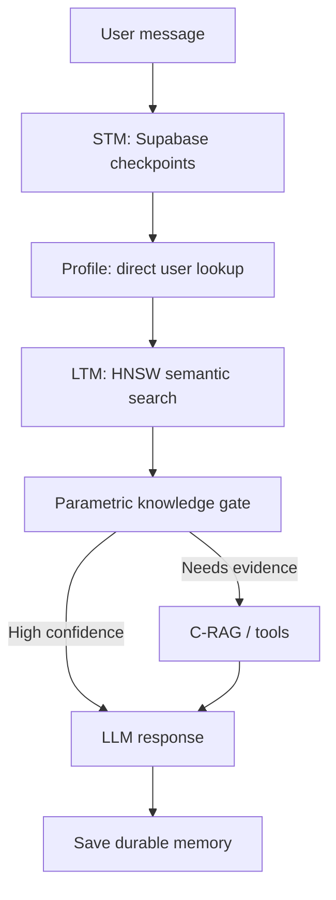

# Multi-Tool Persistent Memory Chatbot

While learning about building agents, i used to learn about new things and implement them in this running project of mine. There may be a bit of sub-optimal decisions taken up at various points while building it but i found this practice really helpful to grasp idea of complex things such as memory management, async/sync flows and HITl (Human in the Loop). Here's a detailed description of this application:

A Streamlit chatbot built with LangGraph that combines persistent conversational state, semantic long-term memory, Corrective RAG (C-RAG), web search, and MCP tools (as of currently)

It supports multiple pre-auth user profiles, persistent named conversations, per-thread PDF question answering, tool-use streaming, and a human-in-the-loop fallback when a document is unavailable.

## Architecture



## Features

- **Persistent STM:** LangGraph checkpoints stored in Supabase Postgres, isolated by `user_id` and `thread_id`.
- **Semantic LTM:** durable user facts stored in Supabase Store and retrieved with HNSW-backed similarity search (top 2 memories).
- **Persistent profiles and threads:** UUID-backed profiles, background-generated chat titles, and thread metadata stored per user.
- **Direct profile lookup:** stable profile data such as display name and future preferences can be loaded without a vector search.
- **C-RAG pipeline:** evaluates retrieved PDF chunks, applies confidence thresholds, and routes to local context, hybrid context + web search, or web search.
- **Parametric knowledge gate:** bypasses RAG and tools only when a high-confidence router decides the orchestrator LLM can answer safely from its own knowledge.
- **PDF RAG:** upload a PDF per conversation; it is chunked, embedded, and indexed in a thread-scoped FAISS retriever. Removing the upload removes its index.
- **Human-in-the-loop fallback:** if no PDF is indexed, the chatbot asks in chat whether it may use web search.
- **Tool calling:** calculator, stock price lookup, Tavily web search through MCP, an expense MCP server, and a local Manim MCP server.
- **Streaming UI:** assistant tokens, tool activity, sources, and generated Manim media are rendered in Streamlit while raw tool payloads stay collapsed.

## Memory Model

| Memory layer | Scope | Storage | Retrieval |
| --- | --- | --- | --- |
| Short-term memory | One user + one thread | LangGraph Postgres checkpoints | Loaded by `thread_id`, then trimmed to fit the model context window |
| User profile | One user | Supabase Store | Direct key lookup; intended for compact, stable user information |
| Long-term memory | One user | Supabase Store | Query embedding + HNSW semantic search, top 2 relevant memories |
| Document knowledge | One active thread | In-memory FAISS | Similarity search over the currently attached PDF; not retained after backend restart |

The profile should remain compact and structured. Long-term memory is for durable but selectively relevant facts; it should not be injected wholesale into every prompt.

## C-RAG Flow

1. The router checks whether the main LLM can answer with very high confidence from parametric knowledge.
2. If not, `rag_tool` retrieves chunks from the thread's PDF index.
3. An evaluator model scores the retrieved chunks against the question.
4. The result is routed by configurable `upper`, `good`, and `lower` thresholds:
   - strong local evidence → use selected document chunks;
   - weak evidence → formulate a Tavily query and search the web;
   - ambiguous evidence → combine strong-enough chunks with web results.
5. The tool returns refined context and source metadata to the orchestration model.

## Project Structure

```text
.
├── chatbot.py                    # Public backend facade used by the frontend
├── chatbot_frontend.py           # Streamlit application
├── chatbot_core/
│   ├── __init__.py
│   ├── settings.py               # Models and environment configuration
│   ├── runtime.py                # Dedicated async event-loop helpers
│   ├── documents.py              # PDF ingestion and thread FAISS indexes
│   ├── mcp_tools.py              # MCP client and non-RAG tools
│   ├── persistence.py            # Supabase STM, LTM, profiles, thread metadata
│   ├── crag.py                   # C-RAG retrieval, evaluation, and web fallback
│   └── graph.py                  # LangGraph state, nodes, routing, and graph
├── manim-mcp-server/             # Local Manim MCP server source
├── requirements.txt
├── .env.example
└── README.md
```

## Prerequisites

- Python 3.11+ recommended
- A Supabase Postgres database
- A Groq API key
- A Tavily API key for web search
- Optional: Alpha Vantage key for stock prices
- Optional: a local Manim installation for animation generation

## Installation

```bash
git clone https://github.com/romancobblepot/Multi-tool-Persistant-Memory-Chatbot.git
cd Multi-tool-Persistant-Memory-Chatbot
python -m venv .venv
source .venv/bin/activate
pip install -r requirements.txt
```

On Windows, activate the environment with:

```powershell
.venv\Scripts\Activate.ps1
```

## Environment Variables

Create a local `.env` file from `.env.example`. Do not commit `.env`.

```env
GROQ_API_KEY=
SUPABASE_DB_URL=
TAVILY_API_KEY=
STOCK_API_KEY=

# Optional model override for the C-RAG / router model
CRAG_MODEL=openai/gpt-oss-20b

# Required only when using the local Manim MCP server
PYTHON_EXECUTABLE=
MANIM_EXECUTABLE=
EXPENSE_MCP_URL=
```

`SUPABASE_DB_URL` is the Postgres connection string, not the public Supabase project URL. If its password has special characters such as `@`, `#`, or `/`, URL-encode the password portion.

## Database Setup

The application uses:

- `AsyncPostgresSaver` for LangGraph checkpoints.
- `AsyncPostgresStore` for profiles, thread metadata, and long-term memories.

On first startup, the backend calls the checkpointer/store setup methods to create the required tables. The long-term-memory store uses 768-dimensional `all-mpnet-base-v2` embeddings, cosine distance, and an HNSW index.

## Run Locally

```bash
streamlit run chatbot_frontend.py
```

Then open the local URL printed by Streamlit.

## Local Manim MCP Server

The Manim MCP server is intentionally local: it launches via `stdio` and writes generated media to the machine running the chatbot. Configure it with project-relative paths or the optional executable environment variables above.

This means the local Manim server will **not** work unchanged on Streamlit Community Cloud. For cloud deployment, either:

- package Manim and its system dependencies in the deployment environment; or
- move animation generation behind a remote MCP/API service.

Keep virtual environments and generated media out of Git:

```gitignore
.venv/
manim-mcp-server/.venv/
manim-mcp-server/media/
media/
__pycache__/
*.py[cod]
.env
*.db
.DS_Store
```

## Current Limitations

- Profiles are pre-auth identities for development. Supabase Auth should become the source of `user_id` in a production deployment.
- PDF FAISS indexes are held in backend memory, so re-upload is required after a process restart.
- Tool availability depends on configured MCP servers and credentials.
- No evaluation, tracing, access-control, or document-permission layer has been added yet; these are important production hardening steps.

## Future Improvements

- Supabase Auth and row-level security.
- Persisted document indexes and document-level permissions.
- LangSmith tracing, evaluation datasets, and regression tests.
- Retrieval quality monitoring, caching, retries, and rate/cost controls.
- A remote/containerised Manim service for cloud deployment.

## Security

Never commit API keys, Supabase credentials, local `.env` files, generated media, or virtual environments. If a secret was ever committed, rotate it in its provider dashboard before continuing.
